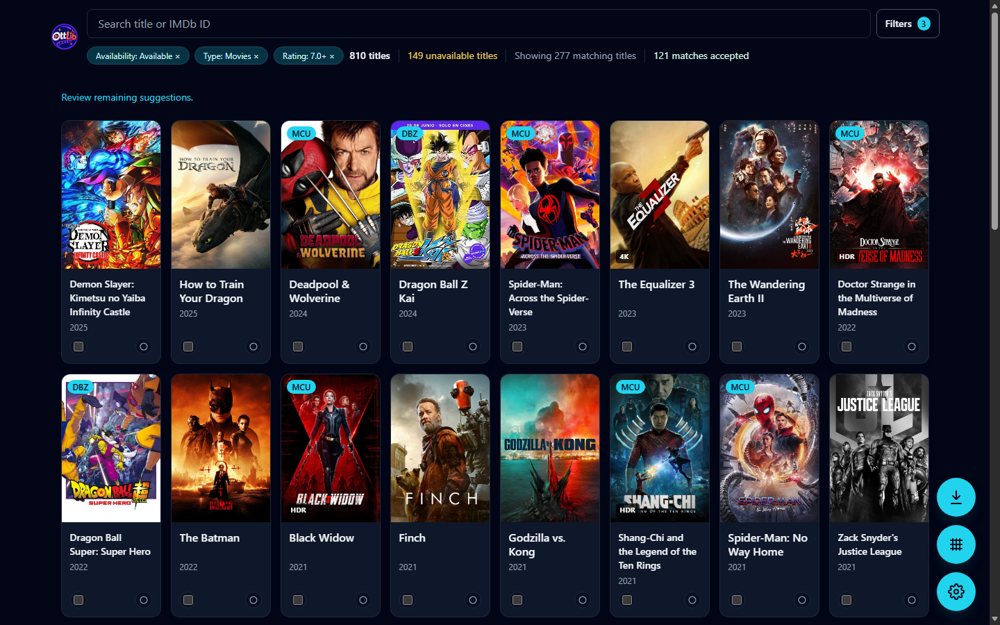
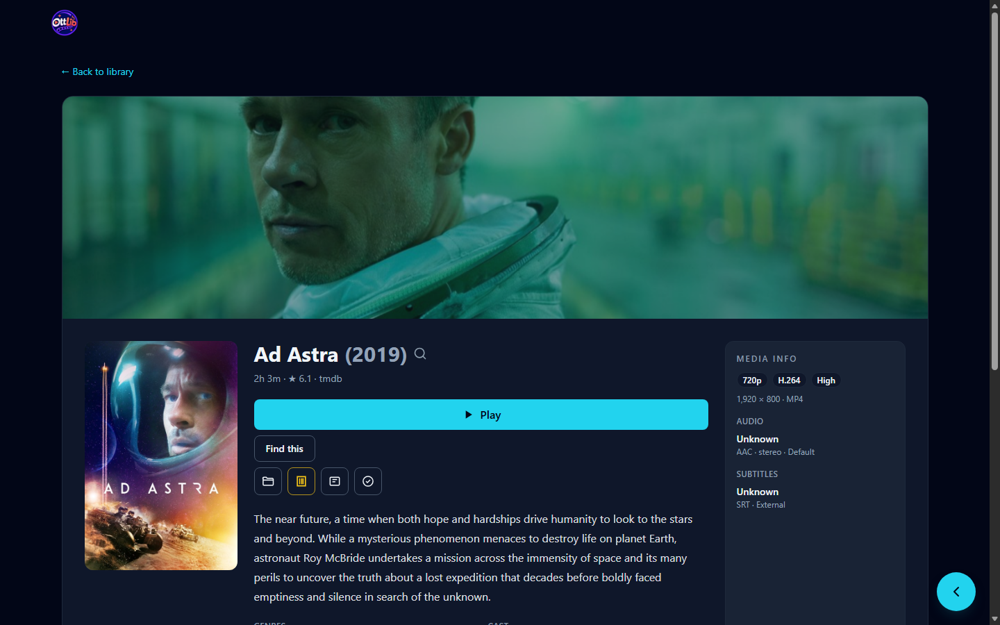

# OttLib

OttLib is a self-hosted movie-library app for a trusted home network. Point it at your video folders, let it match titles and artwork, then browse or play your collection from your PC, another computer on your LAN, or an Android device.

## Highlights

- Scan one or more media folders, with configurable extensions and ignored paths.
- Match movies against TMDb, with OMDb as a fallback, and cache artwork locally.
- Browse a responsive poster grid; search, filter, sort, and mark titles watched per device.
- Review duplicate copies and their technical details.
- Play locally, hand off to a LAN player, open in Android media players, or stream with byte-range support.
- Watch on Android TV / Google TV with a native app: remote-friendly browsing, a built-in player with resume, and automatic server discovery.
- Watch on Android phones and foldables with a touch app: layouts that follow the window (Galaxy Z Fold cover and inner screens), swipe gestures, picture-in-picture, and Flex mode.
- Schedule rescans and review scan progress/history.
- Optionally require an access PIN on every browser and app.
- Optional, off by default: search your own qBittorrent's installed search plugins and hand releases back to it.

## Screenshots





## Stack

- React, Vite, Tailwind CSS, and TanStack Query
- Fastify and TypeScript
- SQLite via `better-sqlite3`

## Prerequisites

- Node.js 22 or later
- npm

Optional integrations:

- A [TMDb API key](https://www.themoviedb.org/settings/api) for automatic metadata and artwork
- An OMDb API key as an additional metadata fallback
- qBittorrent with its Web UI and search plugins enabled, if you turn on the optional torrent search

## Installing

Download the latest [release](https://github.com/ashxtrem/ottlib/releases): a server bundle for Windows, Linux or macOS (extract and run `start.bat` / `start.sh`), plus the Android TV and phone APKs. See [docs/install.md](docs/install.md) for setup, upgrading and verifying downloads. To run from source instead, follow the steps below.

## Getting started

```bash
npm install
npm run dev
```

Open the Vite URL shown in the terminal (normally `http://localhost:5173`). The API server runs on port `8081` by default.

On first start, OttLib copies `config/config.example.json` to `config/config.json` and creates the configured app-data directory. `config/config.json` and `data/` are local-only and are ignored by Git.

In the app, open **Settings** to:

1. Add one or more video-library folders.
2. Enter and test a TMDb API key.
3. Optionally configure OMDb, set an access PIN, or turn on torrent search.
4. Start a scan.

## Configuration

Edit `config/config.json` before starting the server when you need a different port or data location:

```json
{
  "port": 8081,
  "appDataPath": "./data",
  "advertise": true
}
```

Metadata keys, library folders, schedules, and qBittorrent credentials are managed in the Settings page rather than committed to the repository.

Torrent search is off by default. To use it, tick **Torrent search** in Settings, enable **Tools → Options → Web UI** in qBittorrent, create Web UI credentials, and add its URL and credentials in OttLib's Settings page. OttLib ships no search plugins; it uses whatever you have installed in qBittorrent. Anyone who can reach OttLib can use this integration, so set an access PIN if your network isn't private.

## Android TV app

The TV client lives in `apps/android` (a Gradle project; the `tv` module is the app). It needs JDK 17 and the Android SDK (platform 36); the Gradle wrapper downloads everything else.

```bash
cd apps/android
./gradlew :tv:assembleRelease
```

The release build is shrunk with R8 and signed with the debug key unless `apps/android/keystore.properties` exists. Use it on the TV: debug builds are noticeably slower on TV hardware.

Install on a Google TV: enable **Developer options** (Settings → System → About → click *Android TV OS build* seven times), turn on **Wireless debugging** or **USB debugging**, then:

```bash
adb connect <tv-ip>:5555
adb install -r --user 0 apps/android/tv/build/outputs/apk/release/tv-release.apk
adb shell cmd package compile -m speed-profile -f dev.ottlib.tv
```

`--user 0` matters on TVs with a second user profile: without it the app can land in a profile the home screen doesn't show. The `compile` step applies the bundled Compose performance profiles right away; a sideloaded app otherwise runs unoptimised until Android's overnight maintenance, and scrolling stutters.

**Sync** (top right of the navigation bar) asks the server to rescan its library folders, so files you add on the PC show up in the app. It only finds new and removed files; it does not refresh metadata (do that from the web app). It follows the scan and reports "Library synced: N new titles" (or "Library is up to date").

On first launch the app lists Ottlib servers found on the network (mDNS, `_ottlib._tcp`), or you can type the address shown under **Settings → Server info** in the web app. Discovery answers on every real LAN adapter (virtual 169.254.x.x adapters are skipped); if the list stays empty, check that Windows Firewall allows Node.js inbound UDP. Set `"advertise": false` in `config/config.json` to turn discovery off.

Playback uses Media3 (ExoPlayer) with an FFmpeg audio fallback for DTS/TrueHD. For anything the built-in player can't handle (for example styled ASS subtitles), use **Play in another app**.

## Android phone app

The phone and foldable client is the `mobile` module of the same Gradle project. It shares the API client, player setup and screen logic with the TV app; only the screens differ.

```bash
cd apps/android
./gradlew :mobile:assembleRelease
adb install -r apps/android/mobile/build/outputs/apk/release/mobile-release.apk
```

Layouts follow the window, not the device: on a Galaxy Z Fold the cover screen gets a bottom bar and a single-column details page, the inner screen a navigation rail and two panes, and folding or unfolding mid-video doesn't interrupt playback. In the player:

- Tap to show or hide the controls; double-tap the left or right third to skip (taps add up).
- Swipe up or down on the left half for brightness, on the right half for volume; swipe sideways to seek.
- Pinch to switch between Fit and Zoom; the picture button has every picture mode (Smart fill, forced 16:9 / 4:3 / 2.39:1).
- Leaving the app while a video plays shrinks it into picture-in-picture. Half-folded like a laptop (Flex mode), the video sits above the fold with the controls below.

The sync button (top bar of Home and Library) rescans the server's library folders for new and removed files, the same as **Sync** on the TV; metadata is not refreshed.

Resume positions and watched state are per device, as on the TV. The phone must be on the same network as the server.

## Scripts

| Command | Description |
| --- | --- |
| `npm run dev` | Build shared types and start the API and client development servers. |
| `npm run build` | Build the shared package, server, and client. |
| `npm start` | Build everything and start the production server. |
| `npm test` | Run all workspace tests. |

## Project structure

```text
packages/
  client/   React user interface
  server/   Fastify API, SQLite access, scanners, and provider integrations
  shared/   Types shared by client and server
apps/
  android/  Android TV and phone clients (Kotlin, Compose, Media3)
contract/   Server response fixtures the Android app is tested against
config/     Bootstrap configuration example
```

## Notes

OttLib is designed for a single home LAN. There are no user accounts; instead you can set an optional **access PIN** (Settings → Access PIN, 4–8 digits). With a PIN set, every browser and the TV and phone apps must enter it once; repeated wrong PINs lock the client out for increasing periods. Without a PIN, anyone on your network can browse and stream. Either way, keep OttLib behind your local network: it serves plain HTTP and is not hardened for the public internet.

## License

[MIT](LICENSE)
